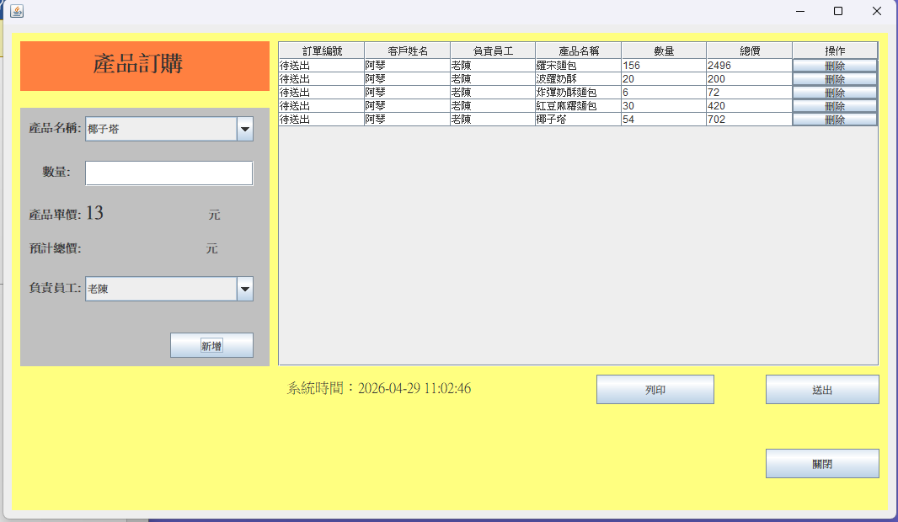

# 🛠 天天新鮮麵包訂購系統 (Bakery Order System)

本專案是一個基於 **Java** 開發的全端訂單管理系統，旨在解決麵包店日常營運中的會員管理、產品上架與批次訂購需求。系統嚴謹遵循 **MVC (Model-View-Controller)** 架構設計，確保程式碼具備高度的可擴充性與維護性。

---

## 🌟 技術棧與架構設計

* **核心語言**：Java (JDK 11)
* **後端技術**：JDBC (Java Database Connectivity)
* **資料庫**：MySQL 8.0
* **前端介面**：Java Swing (桌面級互動 UI)
* **架構拆解**：
    * **Model**：封裝 `Customer`, `Product`, `Orders` 等資料實體。
    * **View**：利用 Swing 元件建構直觀的互動介面。
    * **Controller**：負責 UI 事件監聽與業務邏輯調度。
    * **DAO Layer**：封裝 SQL 操作，實現資料存取邏輯與業務邏輯解耦。

---

## 🚀 核心功能與技術亮點

### 1. 統一登入入口與會員管理
* **多角色管理**：系統將「顧客」與「員工」登入入口整合於同一 UI，透過內部邏輯判斷角色並導向對應功能頁面。
* **帳號校驗機制**：註冊時會即時查詢資料庫防止重複註冊，並給予使用者正確的 UI 回饋。

### 2. 批次訂購與緩存優化
* **即時金額運算**：使用者選擇產品數量時，系統自動動態運算總金額。
* **資料庫 I/O 優化**：設計「先暫存於 JTable，後批次寫入」的策略，降低對資料庫的頻繁請求，提升系統反應速度。

### 3. 產品管理後台 (CRUD)
* 提供完整的新增、修改、刪除功能，確保店員能實時維護產品數據與庫存。

---

## 📸 系統功能展示 (System Showcases)

### 🔐 身份驗證系統
<div align="center">
  
  
  <p><i>由左至右：統一登入入口（含員工通道）、客戶註冊頁面</i></p>
</div>

### 🛒 訂購流程展示
<div align="center">
  
  <br>
  
  <p><i>即時訂購介面與下單成功後的反饋彈窗</i></p>
</div>

### ⚙️ 後台產品管理 (CRUD)
<div align="center">
  
  <br><br>
  
  
  
  <p><i>管理員後台：包含完整的產品清單與新增、修改、刪除操作</i></p>
</div>

---

## 👨‍🏫 核心邏輯展示：批次訂單處理
```java
// 透過迴圈遍歷 JTable 緩存清單，將狀態為「待送出」的資料批次寫入資料庫
for (int i = 0; i < rowCount; i++) {
    if ("待送出".equals(tableModel.getValueAt(i, 0))) {
        model.Orders order = new model.Orders();
        order.setOrders_no("ORD" + (startId + i)); // 自動生成唯一編號
        order.setProduct_no((String) tableModel.getValueAt(i, 7));  
        order.setAmount((int) tableModel.getValueAt(i, 4));
        orderController.processOrder(order); // 呼叫 Controller 執行 JDBC 存取
    }
}
