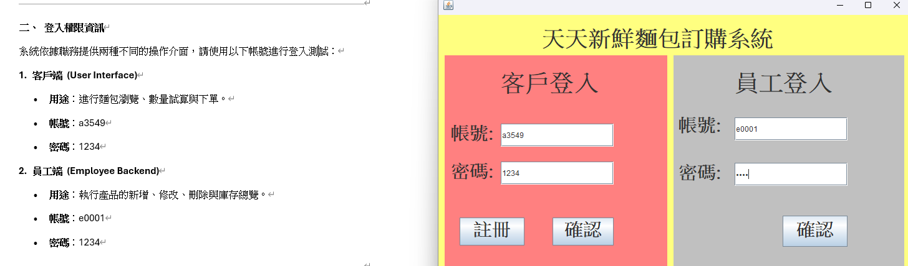
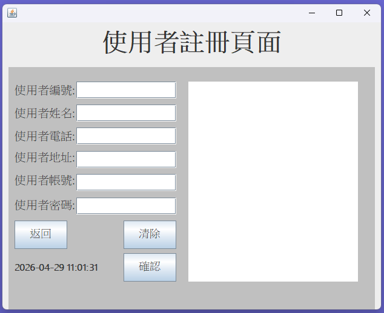
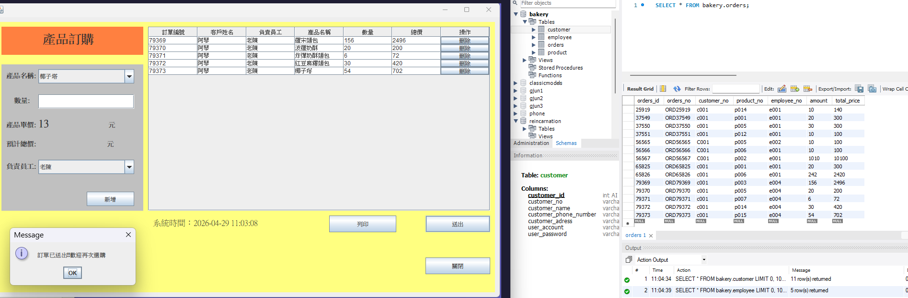
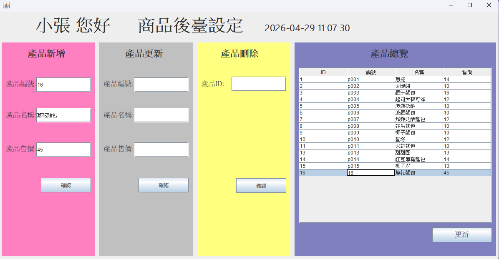
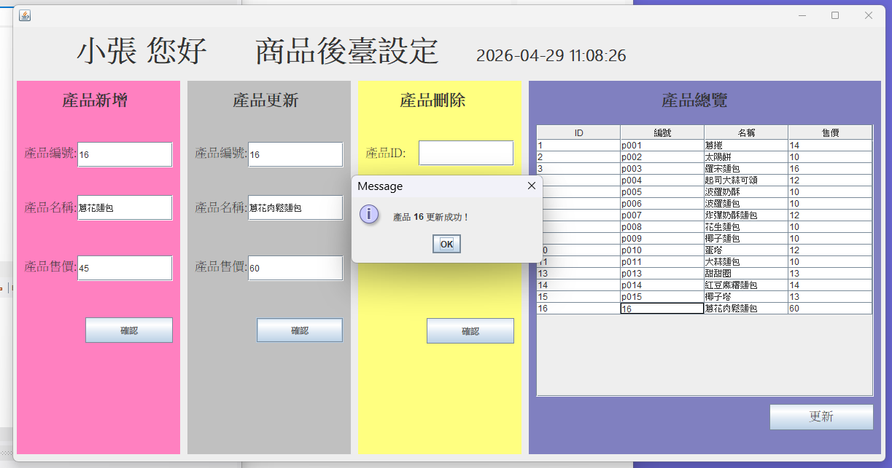
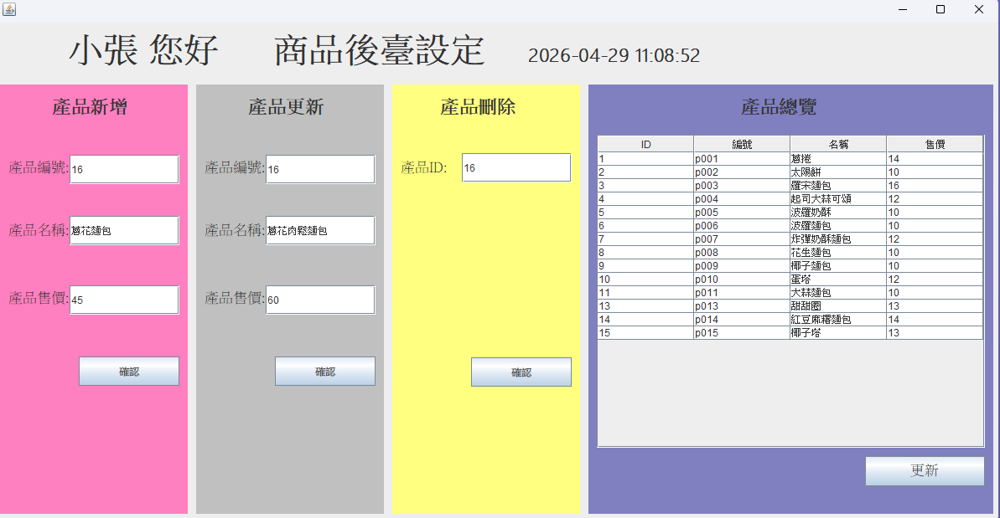

# 🛠 天天新鮮麵包訂購系統 (Bakery Order System)

本專案是一個基於 **Java** 開發的全端訂單管理系統。

---

## 📸 系統功能展示 (System Showcases)

### 🔐 身份驗證系統

  
  
  
<i>左：整合登入入口 / 右：客戶註冊介面</i>

### 🛒 訂購流程展示
支援即時金額運算，並採用批次處理機制將數據寫入資料庫。

  
   
  
<i>左：主訂購介面 / 右：訂單成功寫入反饋</i>

### ⚙️ 後台產品管理 (CRUD)

   
  
  
  
  
<i>管理員端：產品清單與新增、修改、刪除操作</i>

---

## 🌟 技術棧與架構設計
* **核心語言**：Java (Swing, JDBC)
* **資料庫**：MySQL 8.0
* **架構**：嚴謹遵循 MVC 模式，優化資料庫批次寫入邏輯。
